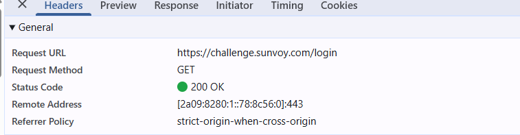
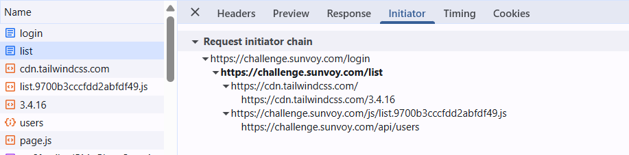

# Reverse_engineering_challenge

Repository used to store reverse engineering technical challenge task

## Task Description

- We are trying to reverse engineer a legacy application, given its url and an authentication credential.

- The application is a web application that uses cookies for handling sessions, and has a private API for the resources (users).
- The goal is to create a typescript project that simulates the requests and responses of the application in the command line.
- The project should be able to authenticate the user and retrieve the user information from the private API.
- The project should be able to handle cookies and sessions, and should be able to simulate the requests and responses of the application in the command line.

## Plan Description

- The first step was to analyze the application using a web browser and web inspector tools to verify the requests and responses.

### Application analysis

#### Login page

The login page presents a form with two fields: username and password.
Submitting the form sends a POST request to the server with the credentials.

- Wrong credentials result in an error message: invalid credentials.
- Correct credentials redirect to the main page, which contains a list of users.

The http request for the login page is as follows:



This request is the GET request that retrieves the login page. The response contains the HTML of the login page.


the request method is POST, and the request parameters are the username and password fields. The response is a redirect to the main page, which contains a list of users.
A success response is indicated by a 302 status code, which means the request was successful and the user was redirected to the main page.

A simplified diagram illustrates how the login process works.


This confirms that the system uses internal API calls and combines it with cookies for getting the results.

#### List of users page



The redirection to the list of users page is initiated by the successful login request. The list of users page is a GET request that retrieves the list of users from the server.
However, the GET request calls upon a POST request to the private API to retrieve a JSON object containing the list of users.

The following diagram illustrates how the list of users page works.


#### User details page

The authenticated user details page is accessed by clicking on the settings button, which operates a number of internal requests to the private API to retrieve the user information.


The image above shows the request initiator for the authenticated user details page. The request is a POST request to the private API, which retrieves the user information in JSON format.
Then the user information is displayed on the page as embedded javascript elements, through the settings..js file.


The image above shows the first request that retrieves the javaScript file that contains the user information. The request is a GET request to the private API, which retrieves the JavaScript file in JSON format.

The following diagram illustrates how the authenticated user details page works.


### Implementation approach

The implementation follows these main steps to simulate the application's workflow and interact with its private API as an authenticated user:

1. **Browser Automation for Authentication**

   - The script uses Puppeteer to launch a headless browser and navigate to the application's login page.
   - It extracts the CSRF nonce token from the login form.
   - The script fills in the username and password fields and submits the form, just like a real user.
   - After submission, it waits for the navigation to complete, ensuring the login was successful.

2. **Session and Cookie Handling**

   - Once logged in, the script extracts all session cookies from the browser.
   - These cookies are stored in a cookie jar and reused for subsequent API requests, mimicking the browser's session management.

3. **Fetching the List of Users**

   - With the authenticated session, the script makes a POST request to the internal `/api/users` endpoint using `node-fetch` and `fetch-cookie` to include the session cookies.
   - The response is parsed as JSON to retrieve the list of users.

4. **Extracting API Tokens for Private Endpoints**

   - The script navigates to the `/settings/tokens` page to extract hidden authentication tokens required for further API calls.
   - These tokens are read directly from the page's HTML inputs.

5. **Fetching the Authenticated User (Custom Signed API Call)**

   - To retrieve the current authenticated user's information, the script must replicate a custom API call found in the application's JavaScript file (`settings.fefd531f237bcd266fc9.js`).
   - This involves generating a POST request to `/api/settings` with a payload that includes authentication tokens, a timestamp, and a signature (`checkcode`) computed using HMAC-SHA1, exactly as the front-end does.
   - The script implements the same signing logic as in the JS file to ensure the API accepts the request.

6. **Data Aggregation and Output**

   - The script combines the list of users and the current user's information.
   - The result is saved to a `users.json` file in the project directory.

7. **Error Handling and Cleanup**
   - The script includes error handling to report issues during any step.
   - Finally, it closes the browser and cleans up resources.

This approach ensures the script closely mimics the real application's workflow, including authentication, session management, and secure API communication, by re-implementing the custom logic found in the application's JavaScript for signed API requests.

## Running the code

- We created the typescript project to simulate the requests and responses of the application in the command line.

- The tools used were:
   - Node.js
   - TypeScript
   - fetch Cookie
   - node fetch
- The code was written in TypeScript to ensure type safety and better maintainability.

- The platform used cookies for handling sessions, and has a private API for the resources (users)


### Steps to run the project

To run the project, you need to do the following steps:

1- Clone the repository:

```bash
git clone https://github.com/Pericles001/Reverse_engineering_challenge.git
```

2- Navigate to the project directory:

```bash
cd reverse_engineering_challenge
```

3- Install the dependencies:

```bash
npm install
```

4- Run the code:

```bash
npm run start
```

- Alternatively, you can format the code using Prettier:

```bash
npm run format
```

Formatting the code will ensure that it adheres to the project's coding standards and improves readability.

- You can also lint the code using ESLint:

```bash
npm run lint
```

Using ESLint will help you identify and fix potential issues in the code, ensuring it follows best practices and coding standards.

#### Dependencies (In case you need to install them manually)

    ├── @eslint/js@9.28.0
    ├── @types/node-fetch@2.6.12
    ├── @types/node@22.15.30
    ├── @typescript-eslint/eslint-plugin@8.33.1
    ├── @typescript-eslint/parser@8.33.1
    ├── eslint@9.28.0
    ├── fetch-cookie@3.1.0
    ├── globals@16.2.0
    ├── node-fetch@3.3.2
    ├── prettier@3.5.3
    ├── puppeteer@24.10.0
    ├── tough-cookie@5.1.2
    ├── ts-node@10.9.2
    ├── typescript-eslint@8.33.1
    └── typescript@5.8.3

## Total time


The total time spent on this project was approximately 4 hours and 40 minutes, including the analysis of the application, implementation of the code, and testing.


[More details on wakatime](https://wakatime.com/@pericles001/projects/qvkefxytsu?start=2025-06-05&end=2025-06-11)

## Author

The code was written by [Pericles001](github.com/Pericles001).

Feel free to reach out if you have any questions or suggestions.

## License

This project is licensed under the Apache 2.0 - see the [LICENSE](LICENSE) file for details.
